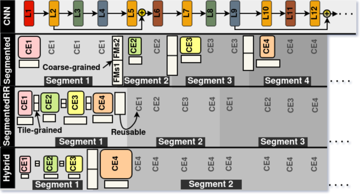

# An Analytical Cost Model for Fast Evaluation of Multiple Compute-Engine CNN Accelerators

This repository contains an implementation of <u>M</u>ultiple <u>C</u>ompute-engine accelerator analytical <u>C</u>ost <u>M</u>odel (__MCCM__) proposed in following paper: [An Analytical Cost Model for Fast Evaluation of Multiple Compute-Engine CNN Accelerators](https://doi.org/10.48550/arXiv.2503.07242)

If you find this repository useful for your research, we would appreciate it if you could cite us using the following BibTeX entry:

```
@misc{qararyah2025analyticalcostmodelfast,
      title={An Analytical Cost Model for Fast Evaluation of Multiple Compute-Engine CNN Accelerators}, 
      author={Fareed Qararyah and Mohammad Ali Maleki and Pedro Trancoso},
      year={2025},
      eprint={2503.07242},
      archivePrefix={arXiv},
      primaryClass={cs.AR},
      url={https://arxiv.org/abs/2503.07242}, 
}
```

## Multiple-CE Accelerators



## <u>M</u>ultiple <u>C</u>ompute-engine accelerator analytical <u>C</u>ost <u>M</u>odel (MCCM)
